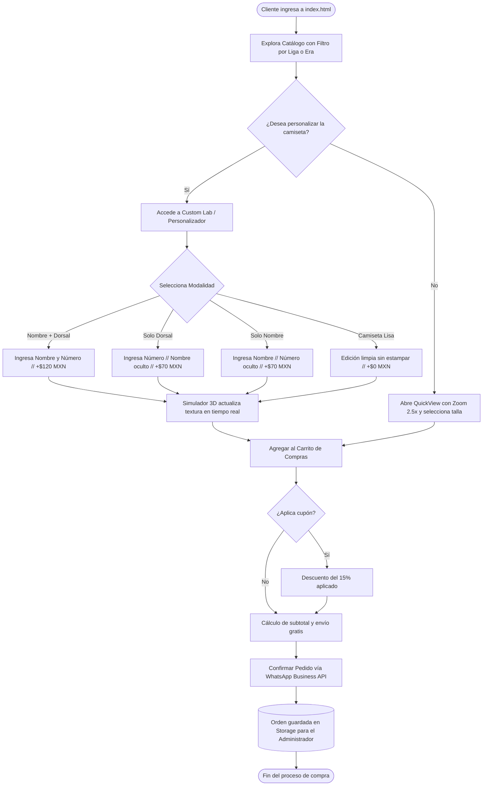
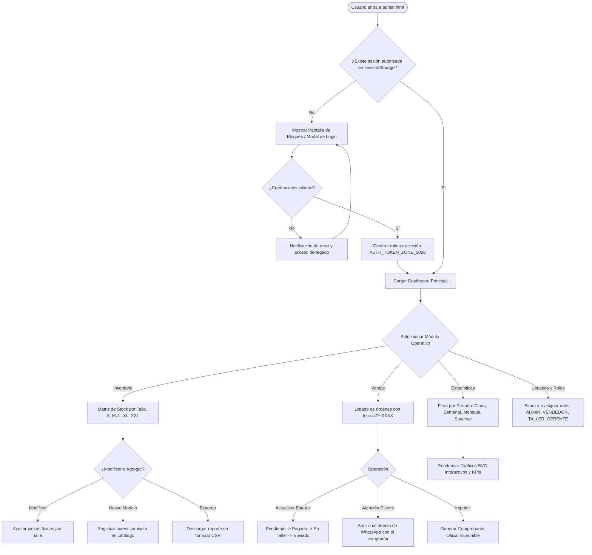
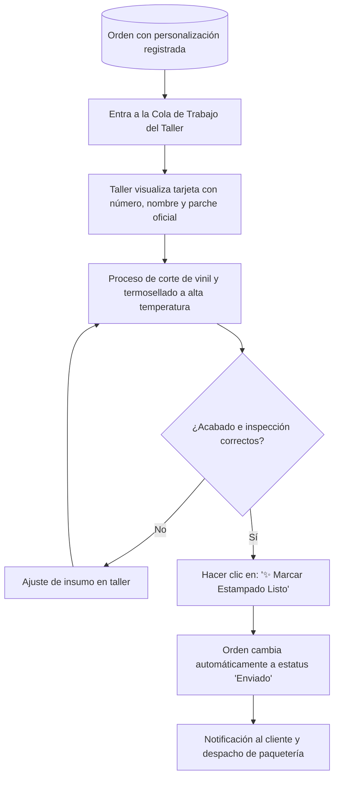

# 📋 DOCUMENTO DE PLANEACIÓN E INGENIERÍA DE SOFTWARE
## PROYECTO: ZONA FÚTBOL — E-COMMERCE & SISTEMA ERP ADMINISTRATIVO

---

**Asignatura / Módulo:** Desarrollo de Aplicaciones Web / Ingeniería de Software  
**Sistema:** Zona Fútbol (Plataforma Comercial & Back-Office Administrativo)  
**Versión del Documento:** 2.5 — Fase de Planeación e Implementación  
**Fecha:** Octubre 2026  
**Autor / Desarrollador:** Equipo de Desarrollo Zona Fútbol  

---

## 📑 ÍNDICE GENERAL
1. **Introducción y Alcance del Proyecto**
2. **Análisis de Requerimientos (SRS — IEEE 830)**
   - 2.1 Requerimientos Funcionales (RF)
   - 2.2 Requerimientos No Funcionales (RNF)
   - 2.3 Casos de Uso del Sistema
3. **Documento de Solución de Requerimientos**
   - 3.1 Arquitectura del Sistema
   - 3.2 Stack Tecnológico
   - 3.3 Matriz de Trazabilidad (Requerimiento vs. Implementación)
4. **Gestión y Metodología del Proyecto**
   - 4.1 Metodología de Desarrollo (Scrum Ágil)
   - 4.2 Estructura de Desglose de Trabajo (WBS / EDT)
   - 4.3 Matriz de Gestión de Riesgos
5. **Diagramas de Flujo del Sistema (Mermaid)**
   - 5.1 Flujo Operativo del Cliente (Tienda & Personalizador)
   - 5.2 Flujo Operativo del Administrador (ERP & Inventario)
   - 5.3 Flujo de Producción del Taller de Estampados
6. **Pseudocódigo de Algoritmos Principales**
   - 6.1 Algoritmo de Personalización Flexible y Cálculo de Precios
   - 6.2 Algoritmo de Conversión Multimoneda Dinámica
   - 6.3 Algoritmo de Filtro y Agregación Analítica por Consulta y Sucursal
   - 6.4 Algoritmo de Control de Stock Multitalla y Despacho

---

## 1. INTRODUCCIÓN Y ALCANCE DEL PROYECTO

### 1.1 Objetivo General
Diseñar, estructurar y desarrollar una plataforma web integral para la comercialización de equipaciones y prendas futboleras oficiales (línea actual 2024/25 y archivo histórico retro), incorporando un motor interactivo de personalización de dorsales en 3D y un **Sistema ERP de Administración (Back-Office)** que permita el control de inventario multitalla, gestión de pedidos, seguimiento de estados logísticos, analítica de ventas multisucursal y asignación de roles corporativos.

### 1.2 Alcance del Sistema
El proyecto abarca dos componentes complementarios e interconectados:
1. **Front-End de Cara al Cliente (`index.html`):** Catálogo con filtros avanzados por liga/era, vista rápida con zoom óptico tipo lupa (MercadoLibre), personalizador flexible de camisetas (Nombre + Número, Solo Dorsal, Solo Nombre, Lisa), selector multimoneda internacional, modo noche/día de estadio y checkout enlazado con la API de WhatsApp Business.
2. **Back-Office / Panel Administrativo (`admin.html`):** Módulo corporativo protegido con barrera de autenticación (`sessionStorage`), control de stock desagregado por tallas (`S`, `M`, `L`, `XL`, `XXL`) con alertas de reorden, gestión de ventas con folio único, módulo de mesa de trabajo para el taller de vinilos y motor de analítica interactiva por período (Diaria, Semanal, Mensual, Histórica) y sucursal.

---

## 2. ANÁLISIS DE REQUERIMIENTOS (SRS — IEEE 830)

### 2.1 Requerimientos Funcionales (RF)

| Código | Módulo | Descripción del Requerimiento Funcional | Prioridad |
| :--- | :--- | :--- | :--- |
| **RF-01** | Catálogo | El sistema debe mostrar el catálogo de camisetas con filtrado dinámico por categoría (Retro / Nueva Temporada), ligas (LaLiga, Premier, Serie A, Selecciones) y barra de búsqueda en tiempo real. | Alta |
| **RF-02** | Ficha Técnica | Debe incluir un visor rápido modal (*QuickView*) con galería de detalles, selector de tallas y **zoom dinámico de aumento 2.5x** que siga el puntero del mouse sobre la prenda. | Media |
| **RF-03** | Personalizador | Debe permitir al cliente configurar su camiseta en 4 modalidades: **Nombre + Dorsal**, **Solo Dorsal**, **Solo Nombre** o **Camiseta Lisa**, actualizando en vivo el lienzo visual y recalculando el precio con suplementos. | Alta |
| **RF-04** | Carrito | Debe gestionar una cesta de compras persistente con contador dinámico, cálculo de umbral de envío gratis ($999 MXN) y validación de cupones de descuento (ej. `RETRO2026`). | Alta |
| **RF-05** | Checkout | Debe generar un mensaje estructurado y codificado para WhatsApp Business con el detalle de la prenda, talla, modalidad de estampado, dirección y método de pago. | Alta |
| **RF-06** | Multimoneda | Debe permitir alternar dinámicamente entre 6 divisas (MXN, USD, EUR, GBP, ARS, COP), recalculando todos los precios en pantalla en tiempo real sin recargar la página. | Media |
| **RF-07** | Tema Visual | Debe incluir un interruptor para alternar entre el **Modo Día** y el **Modo Noche de Estadio** (*Dark Mode*), persistiendo la preferencia en `localStorage`. | Baja |
| **RF-08** | Seguridad Admin | El panel administrativo debe estar protegido por una barrera de autenticación (*Auth Guard*) y login con credenciales válidas, restringiendo el acceso público no autorizado. | Alta |
| **RF-09** | Inventario | Debe llevar el conteo físico de unidades desglosado por tallas (S, M, L, XL, XXL) con alertas semafóricas: `En Stock`, `Stock Crítico (≤ 5 uds)` y `Agotado (0 uds)`. | Alta |
| **RF-10** | Gestión Ventas | Debe registrar cada transacción con folio único (`#ZF-1048`), cliente, sucursal, estatus editable (`Pendiente`, `Pagado`, `En Taller`, `Enviado`, `Entregado`) y ticket imprimible. | Alta |
| **RF-11** | Estadísticas | Debe calcular métricas KPI (Ingresos, Unidades, Ticket Promedio, Tasa de Personalización) y renderizar gráficos SVG dinámicos según filtros temporales y de sucursal. | Alta |
| **RF-12** | Taller Dorsales | Debe listar exclusivamente las órdenes que lleven vinilo o parches pendientes para su termosellado en la mesa de trabajo del taller. | Media |
| **RF-13** | Roles y Accesos | Debe permitir cambiar y simular roles de usuario (`ADMIN`, `VENDEDOR`, `TALLER`, `GERENTE`) con permisos segmentados según el perfil. | Media |

### 2.2 Requerimientos No Funcionales (RNF)

* **RNF-01 — Rendimiento y Velocidad:** La aplicación debe renderizar el catálogo y responder a filtros en menos de 100 ms, sin bloqueos en el hilo principal de ejecución.
* **RNF-02 — Usabilidad (UI/UX):** Interfaz moderna estilo *Ultra Clean* y *SaaS Dashboard*, con tipografías de alta legibilidad (`Plus Jakarta Sans`, `Cabinet Grotesk`), soporte táctil y diseño responsivo (*Mobile First*).
* **RNF-03 — Compatibilidad:** Funcionamiento garantizado en los navegadores modernos estándar del mercado (Google Chrome, Microsoft Edge, Mozilla Firefox y Apple Safari).
* **RNF-04 — Disponibilidad y Despliegue:** Operación como aplicación web autónoma (SPA desacoplada) sin requerir instalación obligatoria de servidores locales o dependencias binarias externas.
* **RNF-05 — Integridad y Persistencia:** Sincronización bidireccional entre la tienda y el panel de administración a través de la Web Storage API (`localStorage` y `sessionStorage`).

---

## 3. DOCUMENTO DE SOLUCIÓN DE REQUERIMIENTOS

### 3.1 Arquitectura del Software
Se implementó una arquitectura basada en **Componentes Modulares Desacoplados y Manejo de Estado Centralizado Unidireccional** (patrón *Store/State Management* en Vanilla JS):

```
┌────────────────────────────────────────────────────────┐
│                   CAPA DE PRESENTACIÓN                 │
│  ┌─────────────────────────┐ ┌──────────────────────┐  │
│  │ Tienda Cliente          │ │ Panel Administrativo │  │
│  │ (index.html, styles.css)│ │ (admin.html, admin.css│  │
│  └────────────┬────────────┘ └──────────┬───────────┘  │
└───────────────┼─────────────────────────┼──────────────┘
                │                         │
┌───────────────▼─────────────────────────▼──────────────┐
│                    CAPA LÓGICA (JS)                    │
│  ┌─────────────────────────┐ ┌──────────────────────┐  │
│  │ Motor Tienda (app.js)   │ │ Motor ERP (admin.js) │  │
│  │ - Multimoneda           │ │ - Matriz Stock Tallas│  │
│  │ - Personalizador 3D     │ │ - Motor Analítica SVG│  │
│  │ - Carrito & Checkout WA │ │ - Auth Guard & Roles │  │
│  └────────────┬────────────┘ └──────────┬───────────┘  │
└───────────────┼─────────────────────────┼──────────────┘
                │                         │
┌───────────────▼─────────────────────────▼──────────────┐
│                 CAPA DE PERSISTENCIA                   │
│   Web Storage API: localStorage & sessionStorage       │
│   - zonafutbol_cart         - zonafutbol_admin_orders  │
│   - zonafutbol_theme        - zonafutbol_admin_inventory
│   - zonafutbol_currency     - zonafutbol_admin_token   │
└────────────────────────────────────────────────────────┘
```

### 3.2 Stack Tecnológico Seleccionado
* **HTML5 Semántico:** Estructura accesible (`<header>`, `<nav>`, `<main>`, `<section>`, `<aside>`, `<footer>`, `<dialog>`).
* **CSS3 Avanzado:** Maquetación con CSS Grid y Flexbox, variables CSS nativas (*Custom Properties*), transformaciones tridimensionales (`perspective`, `rotateY`), animaciones clave y diseño adaptable.
* **JavaScript ES6+ Vanilla:** Modular, reactivo, sin librerías pesadas para garantizar máxima velocidad y portabilidad académica.
* **Three.js & Canvas:** Para simulación de rotación e iluminación de camisetas en el estudio interactivo.
* **Web Audio API:** Síntesis nativa de efectos sonoros de estadio (silbato, clic táctil, ovación de gol).
* **SVG Vectorial Dinámico:** Generación algorítmica de curvas de ventas y gráficos analíticos interactivos.

### 3.3 Matriz de Trazabilidad (Requerimiento vs. Implementación)

| Código RF | Archivo / Función Implementada | Mecanismo de Validación |
| :--- | :--- | :--- |
| **RF-01** | `app.js` (`renderProducts`, `filterProducts`) | Búsqueda por inputs y filtros de botones de liga. |
| **RF-02** | `app.js` (`openQuickView`, `setupMercadoLibreZoom`) | Hover dinámico con cálculo de coordenadas en escala 2.5x. |
| **RF-03** | `index.html`, `app.js` (`setCustomizerMode`, `updateCustomizerPreview`) | Validación de 4 estados visuales y recálculo de suplementos. |
| **RF-04** | `app.js` (`addToCart`, `calculateCartTotals`, `applyCoupon`) | Validación de storage y barra progresiva a $999 MXN. |
| **RF-05** | `app.js` (`submitOrderToWhatsApp`) | Enlace URL codificado `https://wa.me/...` con payload completo. |
| **RF-06** | `app.js` (`CURRENCIES`, `formatMoney`, `changeStoreCurrency`) | Conversión por tasa de cambio y símbolo de 6 países. |
| **RF-07** | `app.js` (`toggleThemeMode`), `styles.css` (`body.dark-mode`) | Conmutación de clases CSS y persistencia en storage. |
| **RF-08** | `admin.html`, `admin.js` (`checkAdminAuthGuard`, `handleAdminBarrierLoginSubmit`) | Bloqueo con modal `admin-auth-barrier` ante token ausente. |
| **RF-09** | `admin.js` (`renderInventoryTable`, `handleEditStockSubmit`) | Tabla matricial de tallas S-XXL con badges condicionales. |
| **RF-10** | `admin.js` (`renderSalesTable`, `changeOrderStatus`, `openOrderDetail`) | Actualización selectiva de estatus y apertura de tickets. |
| **RF-11** | `admin.js` (`renderSalesEvolutionChart`, `renderBranchBreakdown`) | Construcción paramétrica de rutas `<path>` y polígonos SVG. |
| **RF-12** | `admin.js` (`renderWorkshopQueue`, `completeWorkshopDorsal`) | Filtro de órdenes con estampado en estado "En Taller". |
| **RF-13** | `admin.js` (`changeActiveUserRole`, `updateActiveUserUI`) | Asignación de permisos dinámicos y cambio de usuario en sesión. |

---

## 4. GESTIÓN Y METODOLOGÍA DEL PROYECTO

### 4.1 Metodología de Desarrollo (Scrum Adaptado)
El proyecto se dividió en 4 Sprints incrementales con entregables verificables:

```
[Sprint 1: Fundación & Catálogo]
 ├── Definición de requerimientos visuales y paleta Ultra Clean
 ├── Maquetación base de index.html y arquitectura responsiva
 └── Integración de fotografías de alta resolución auténticas

[Sprint 2: Motor Comercial & Personalizador 3D]
 ├── Desarrollo del personalizador interactivo de dorsales
 ├── Reglas de negocio para modalidades (Solo Número, Solo Nombre, Lisa)
 └── Cesta de compras y pasarela de despacho por WhatsApp

[Sprint 3: Back-Office & Sistema ERP (Tarea 2.4)]
 ├── Estructuración de admin.html, admin.css y admin.js
 ├── Matriz de inventario desagregado por tallas S-XXL
 ├── Módulo de ventas con seguimiento de estatus
 └── Motor analítico con gráficos interactivos multisucursal

[Sprint 4: Refinamiento, Seguridad & UX Avanzada]
 ├── Implementación de barrera de autenticación y roles
 ├── Sistema multimoneda dinámico y Modo Noche de Estadio
 └── Zoom estilo MercadoLibre y preparación de documentación
```

### 4.2 Matriz de Gestión de Riesgos

| Riesgo Identificado | Probabilidad | Impacto | Estrategia de Mitigación Implementada |
| :--- | :---: | :---: | :--- |
| **Acceso no autorizado al panel administrativo** | Media | Alto | Implementación de *Auth Guard* con validación de tokens en `sessionStorage` y credenciales de acceso. |
| **Inconsistencia de stock al vender en mostrador vs. web** | Media | Alto | Sincronización en tiempo real en `localStorage` deduciendo piezas específicas de la talla elegida. |
| **Tiempos lentos de carga por imágenes pesadas** | Alta | Medio | Descarga y compresión optimizada en formato JPEG de alta densidad en el directorio local `imagenes/camisetas/`. |
| **Pérdida de compras en carritos abandonados** | Media | Medio | Persistencia automática en el navegador y checkout directo por WhatsApp con mensaje pre-redactado. |

---

## 5. DIAGRAMAS DE FLUJO DEL SISTEMA (MERMAID)

### 5.1 Flujo Operativo del Cliente (Tienda & Personalizador)



---

### 5.2 Flujo Operativo del Administrador (ERP & Inventario)



---

### 5.3 Flujo de Producción del Taller de Estampados



---

## 6. PSEUDOCÓDIGO DE ALGORITMOS PRINCIPALES

### 6.1 Algoritmo de Personalización Flexible y Cálculo de Precios

```text
ALGORITMO CalcularPersonalizacionYPrecios
    ENTRADAS:
        producto_seleccionado: Objeto Producto
        modo_estampado: Cadena ('full', 'number-only', 'name-only', 'plain')
        nombre_texto: Cadena
        numero_texto: Cadena
        parche_seleccionado: Cadena
        moneda_actual: Cadena ('MXN', 'USD', 'EUR', etc.)
    SALIDAS:
        precio_total_formateado: Cadena
        estado_canvas_visual: Objeto UI

    INICIO
        precio_base <- producto_seleccionado.precio
        suplemento_estampado <- 0
        suplemento_parche <- 0

        // Evaluar modalidad de estampado
        SEGÚN modo_estampado HACER
            CASO 'full':
                HabilitarCampo(input_nombre)
                HabilitarCampo(input_numero)
                suplemento_estampado <- 120
                MostrarTextoEnCanvas(preview_nombre, MAYÚSCULAS(nombre_texto))
                MostrarTextoEnCanvas(preview_numero, numero_texto)
                OcultarElemento(indicador_edicion_lisa)
            CASO 'number-only':
                DeshabilitarCampo(input_nombre)
                HabilitarCampo(input_numero)
                suplemento_estampado <- 70
                OcultarTextoEnCanvas(preview_nombre)
                MostrarTextoEnCanvas(preview_numero, numero_texto) // Centrado vertical
                OcultarElemento(indicador_edicion_lisa)
            CASO 'name-only':
                HabilitarCampo(input_nombre)
                DeshabilitarCampo(input_numero)
                suplemento_estampado <- 70
                MostrarTextoEnCanvas(preview_nombre, MAYÚSCULAS(nombre_texto))
                OcultarTextoEnCanvas(preview_numero)
                OcultarElemento(indicador_edicion_lisa)
            CASO 'plain':
                DeshabilitarCampo(input_nombre)
                DeshabilitarCampo(input_numero)
                suplemento_estampado <- 0
                OcultarTextoEnCanvas(preview_nombre)
                OcultarTextoEnCanvas(preview_numero)
                MostrarElemento(indicador_edicion_lisa) // Reverso limpio
        FIN_SEGÚN

        // Evaluar costo de parche oficial
        SI parche_seleccionado CONTIENE "Champions" O parche_seleccionado CONTIENE "Mundial" ENTONCES
            suplemento_parche <- 80
        SINO SI parche_seleccionado CONTIENE "Liga" ENTONCES
            suplemento_parche <- 50
        SINO
            suplemento_parche <- 0
        FIN_SI

        total_mxn <- precio_base + suplemento_estampado + suplemento_parche
        precio_total_formateado <- ConvertirMoneda(total_mxn, moneda_actual)

        ActualizarDOM("cust-total-price", precio_total_formateado)
        ActualizarBotonCarrito("Agregar al Carrito: " + precio_total_formateado)
    FIN
```

---

### 6.2 Algoritmo de Conversión Multimoneda Dinámica

```text
ALGORITMO ConvertirMoneda (monto_mxn, codigo_divisa)
    TABLA TASAS_CAMBIO:
        MXN -> { simbolo: "$", tasa: 1.0,   sufijo: "MXN" }
        USD -> { simbolo: "$", tasa: 0.054, sufijo: "USD" }
        EUR -> { simbolo: "€", tasa: 0.049, sufijo: "EUR" }
        GBP -> { simbolo: "£", tasa: 0.042, sufijo: "GBP" }
        ARS -> { simbolo: "$", tasa: 52.0,  sufijo: "ARS" }
        COP -> { simbolo: "$", tasa: 215.0, sufijo: "COP" }

    INICIO
        config <- TASAS_CAMBIO[codigo_divisa]
        SI config ES NULO ENTONCES
            config <- TASAS_CAMBIO["MXN"]
        FIN_SI

        monto_convertido <- REDONDEAR(monto_mxn * config.tasa)
        RETORNAR config.simbolo + FormatearConComas(monto_convertido) + " " + config.sufijo
    FIN
```

---

### 6.3 Algoritmo de Filtro y Agregación Analítica por Consulta y Sucursal

```text
ALGORITMO GenerarAnaliticaConsulta (lista_ordenes, periodo_filtro, sucursal_filtro)
    INICIO
        ordenes_filtradas <- []
        tiempo_actual <- ObtenerTimestampActual()

        PARA CADA orden EN lista_ordenes HACER
            // Validar filtro de sucursal
            pasa_sucursal <- FALSO
            SI sucursal_filtro == 'todas' O orden.sucursal CONTIENE sucursal_filtro ENTONCES
                pasa_sucursal <- VERDADERO
            FIN_SI

            // Validar filtro temporal
            dias_diferencia <- (tiempo_actual - orden.timestamp) / (1000 * 60 * 60 * 24)
            pasa_tiempo <- FALSO

            SI periodo_filtro == 'diaria' Y dias_diferencia <= 1 ENTONCES
                pasa_tiempo <- VERDADERO
            SINO SI periodo_filtro == 'semanal' Y dias_diferencia <= 7 ENTONCES
                pasa_tiempo <- VERDADERO
            SINO SI periodo_filtro == 'mensual' Y dias_diferencia <= 30 ENTONCES
                pasa_tiempo <- VERDADERO
            SINO SI periodo_filtro == 'historica' ENTONCES
                pasa_tiempo <- VERDADERO
            FIN_SI

            SI pasa_sucursal Y pasa_tiempo ENTONCES
                AGREGAR orden A ordenes_filtradas
            FIN_SI
        FIN_PARA

        // Agregación de KPIs
        ingresos_totales <- 0
        ordenes_validas <- 0
        ordenes_con_estampado <- 0

        PARA CADA orden EN ordenes_filtradas HACER
            SI orden.estatus != 'Cancelado' ENTONCES
                ingresos_totales <- ingresos_totales + orden.precio
                ordenes_validas <- ordenes_validas + 1

                SI orden.nombre != "" O orden.numero != "" O orden.parche != "Sin parches" ENTONCES
                    ordenes_con_estampado <- ordenes_con_estampado + 1
                FIN_SI
            FIN_SI
        FIN_PARA

        ticket_promedio <- SI ordenes_validas > 0 ENTONCES ingresos_totales / ordenes_validas SINO 0
        tasa_personalizacion <- SI ordenes_validas > 0 ENTONCES (ordenes_con_estampado / ordenes_validas) * 100 SINO 0

        RenderizarPuntosSVG(ordenes_filtradas, periodo_filtro)
        RETORNAR { ingresos: ingresos_totales, total_pedidos: ordenes_validas, ticket_prom: ticket_promedio, tasa_custom: tasa_personalizacion }
    FIN
```

---

### 6.4 Algoritmo de Control de Stock Multitalla y Despacho

```text
ALGORITMO DespacharVentaYActualizarStock (orden_id, producto_id, talla_solicitada)
    INICIO
        producto <- BuscarProductoPorId(producto_id)
        orden <- BuscarOrdenPorId(orden_id)

        SI producto ES NULO O orden ES NULO ENTONCES
            MostrarError("Producto u orden no encontrados")
            RETORNAR FALSO
        FIN_SI

        stock_disponible <- producto.stock[talla_solicitada]

        SI stock_disponible <= 0 ENTONCES
            MostrarAlerta("¡ALERTA!: La talla " + talla_solicitada + " está agotada.")
            orden.estatus <- "Pendiente de Abastecimiento"
            RETORNAR FALSO
        SINO
            // Reducción de existencias físicas
            producto.stock[talla_solicitada] <- stock_disponible - 1
            
            SI (producto.stock[talla_solicitada]) <= 2 ENTONCES
                NotificarReorden("Stock crítico en modelo: " + producto.nombre + " (Talla " + talla_solicitada + ")")
            FIN_SI

            // Determinar si pasa a taller de termosellado o a empaque directo
            SI orden.modo == 'plain' ENTONCES
                orden.estatus <- "Enviado"
            SINO
                orden.estatus <- "En Taller" // Requiere vinil
            FIN_SI

            GuardarStorage("zonafutbol_admin_inventory", productos)
            GuardarStorage("zonafutbol_admin_orders", ordenes)
            ActualizarTablasVisuales()
            RETORNAR VERDADERO
        FIN_SI
    FIN
```

---

## 7. CONCLUSIÓN Y VERIFICACIÓN
Este documento de planeación e ingeniería de software proporciona la trazabilidad completa desde la captura inicial de requerimientos hasta el despliegue de las soluciones técnicas implementadas en **Zona Fútbol**. El sistema demuestra solidez arquitectónica, modularidad, escalabilidad e interoperabilidad entre el entorno comercial y el entorno de administración empresarial.
